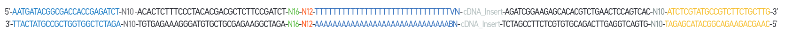

# 10x multinome of ATAC-seq and RNA-seq

## Raw data formats
### Barcodes
#### Single Cell Multiome Gel Beads A (PN- 2000261)

The **10x Barcode** on the ATAC and GEX primers on the same Gel Bead are **NOT identical**. 
Each Gel Bead has a unique pairing of ATAC and GEX barcode. 
#### Chromium Single Cell Multiome ATAC Library


#### Chromium Single Cell Multiome GEM Library


### Raw fastq
#### ATAC libraries
Consist of standard Illumina® paired-end dsDNA. Sequencing the libraries produces produces a standard Illumina® BCL data 
output folder that includes fastq files: \
`[Sample Name]_S1_L00[Lane Number]_[Read Type]_001.fastq.gz` \
where `[Read Type]` is one of:
* I1: Dual index i7 read (optional) – includes the 8bp Sample Index
* R1: Read 1N
* R2: Dual index i5 read (optional) – includes the 16bp 10x Barcode
* R3: Read 2N

Read 1N and Read 2N are paired-end reads used for sequencing the DNA insert.

#### GEX libraries
Consist of standard Illumina® paired-end cDNA. Sequencing the libraries produces produces a standard Illumina® BCL data 
output folder that includes fastq files: \
`[Sample Name]_S1_L00[Lane Number]_[Read Type]_001.fastq.gz` \
where `[Read Type]` is one of:
* I1: Dual index i7 read (optional) - includes the 10bp sample index sequence i7.
* R1: TruSeq Read 1 - used to sequence the 16 bp 10x Barcodes + 12 bp UMI
* R2: Dual index i5 read (optional) - includes the 10bp sample index sequence i5.
* R3: TruSeq Read 2 - used to sequence the insert

### BAM
#### [ATAC BAM](https://support.10xgenomics.com/single-cell-multiome-atac-gex/software/pipelines/latest/output/bam-atac)
The `cellranger-arc count` outputs `atac_possorted_bam.bam`, 
a position-sorted and indexed BAM file for the Chromatin Accessibility library.
Tags:
* `CB`	Z   - Chromium cellular barcode sequence that is error-corrected, 
confirmed against a list of known-good barcode sequences and translated.
    * Barcode translation - the _in silico_ translation of the error-corrected ATAC barcode
    to its corresponding paired GEX barcode.
* `CR`	Z	- Chromium cellular barcode sequence as reported by the sequencer.
* `CY`	Z	- Chromium cellular barcode read quality. Phred scores as reported by sequencer.
* `BC`	Z	- Sample index read.
* `QT`	Z	- Sample index read quality. Phred scores as reported by sequencer.
* `TR`	Z	- Adapter sequence trimmed off the end of the read.
* `TQ`	Z	- Base quality for the trimmed adapater sequence. Phred scores as reported by sequencer.
* `GP`	i	- Genome position. _Note: this is an auxiliary tag used for the purpose of 
duplicate marking and is not intended for downstream use. We intend to deprecate this tag in subsequent versions._
* `MP`	i	- Genome position of mate-pair. _Note: this is an auxiliary tag used for the purpose 
of duplicate marking and is not intended for downstream use. We intend to deprecate this tag in 
subsequent versions._

#### [GEX BAM](https://support.10xgenomics.com/single-cell-multiome-atac-gex/software/pipelines/latest/output/bam-gex)
The `cellranger-arc` outputs a position-sorted and indexed BAM file of read alignments 
to the genome and transcriptome. 
Reads aligned to the transcriptome across **exon junctions** in the genome tend to have a large gap 
in their CIGAR string i.e. 35M225N64M. Each read in this BAM file has a 10x Chromium cellular 
(associated with a 10x gel bead) barcode and molecular barcode information attached. 
Cell Ranger ARC modifies MAPQ values

10x Chromium barcode (associated with a 10x gel bead) and molecular barcode information 
for each read is stored as TAG fields:

* `CB`	Z	- Chromium cellular barcode sequence that is error-corrected and confirmed against 
a list of known-good barcode sequences.
* `CR`	Z	- Chromium cellular barcode sequence as reported by the sequencer.
* `CY`	Z	- Chromium cellular barcode read quality. Phred scores as reported by sequencer.

* `UB`	Z	- Chromium molecular barcode sequence that is error-corrected among other 
molecular barcodes with the same cellular barcode and gene alignment.
* `UR`	Z	- Chromium molecular barcode sequence as reported by the sequencer.
* `UY`	Z	- Chromium molecular barcode read quality. Phred scores as reported by sequencer.

The following tags will also be present on reads that mapped to the genome and overlapped 
either an exon or an intron by at least one base pair (default mode). 
When `cellranger-arc count` is run with the `--gex-exclude-introns` argument, 
alignment tags are restricted to reads overlapping exons. 
A read may align to multiple transcripts and genes, but **it is only considered confidently 
mapped to the transcriptome if it maps to a single gene**.

* `RE`	A	Single character indicating the region type of this alignment 
(`E` = exonic, `N` = intronic, `I` = intergenic).
* `TX` 	Z	Semicolon-separated list present in reads aligned to the same strand as the 
transcripts (or genes) compatible with this alignment. In case of a transcriptomic alignment 
overlapping an exonic region the format of each entry is `[transcript_id]`,`[strand][pos]`,`[cigar]`;
 where `transcript_id` is specifed by the reference GTF, strand is either `+` or `-`, `pos` is the 
 alignment offset in transcript coordinates, and `cigar` is the CIGAR string in t
 ranscript coordinates. In case of a genomic alignment overlapping an intronic region the 
 format of each entry is `[gene_id],[strand]`; where `gene_id` is specifed by the reference 
 GTF and strand is either `+` or `-`.
* `AN`	Z	Same as the TX tag, but for reads that are aligned to the antisense strand 
of annotated transcripts (or genes).
* `GX` 	Z	Semicolon-separated list of gene IDs that are compatible with this alignment. 
Gene IDs are specified with the `gene_id` key in the reference GTF attribute column.
* `GN` 	Z	Semicolon-separated list of gene names that are compatible with this alignment. 
Gene names are specified with `gene_name` key in the reference GTF attribute column.
* `MM`	i	Set to 1 if the genome-aligner (STAR) originally gave a **MAPQ < 255** 
(it multi-mapped to the genome) and Cell Ranger changed it to 255 because the read overlapped 
exactly one gene.
* `pa`	i	The number of poly-A nucleotides trimmed from the 3' end of read 2. Up to 10% 
mismatches are permitted.
* `ts` 	i	The number of template switch oligo (TSO) nucleotides trimmed from 
the 5' end of read 2. Up to 3 mismatches are permitted. The 30-bp TSO sequence 
is `AAGCAGTGGTATCAACGCAGAGTACATGGG`.
* `xf`	i	Extra alignment flags. The bits of this tag are interpreted as follows:
    * `1` - The read is confidently mapped to a feature
    * `2` - The read maps to a feature that the majority of other reads with the 
    same (Barcode, UMI) pair did not. Discarded as belonging to a low-support molecule.
    * `8` - This read is representative for the molecule and can be treated as a UMI count
    * Bits `4` and `16` are used internally by 10X.

### [TSO (template switch oligo)](https://kb.10xgenomics.com/hc/en-us/articles/360001493051-What-is-a-template-switch-oligo-TSO-)
* The TSO is hybridizes to untemplated C nucleotides added by the reverse transcriptase during 
**reverse transcription**. The TSO **adds a common 5' sequence to full length cDNA** that is used for 
downstream cDNA amplification.
* TSO sequence (30bp): `AAGCAGTGGTATCAACGCAGAGTACATGGG`
* The TSO is used differently between the Single Cell 3’ and Single Cell 5' assay. 
    * In the 3' assay, the polyd(T) is part of the gel bead oligo (+10x Barcode, UMI,  partial Illumina Read 1), with the TSO supplied in the RT Primer.
    * In the 5' assay, the polyd(T) is supplied in the RT Primer, and the TSO is part of the gel bead oligo.
* Tags `ts:i` and `pa:i` in the output GEX BAM files indicate the number of TSO nucleotides 
trimmed from the 5' end of read 2 and the number of poly-A nucleotides trimmed from the 3' end. 
The trimmed bases are present in the sequence of the BAM record and are soft clipped in the CIGAR string.

## [Cell calling](https://support.10xgenomics.com/single-cell-multiome-atac-gex/software/pipelines/latest/algorithms/cell-calling)
Identify the barcodes of cell population from the non-cell background using **paired information**:
* ATAC peak-bc matrix: count of transposition events in peaks
* GEX gene-bc matrix: gene expression UMIs 
The cell-calling algorithm uses this paired information to identify 

Steps:

1. Barcodes filtering
    1. ATAC "low targeting" barcodes: 
        
        Barcode whose **fraction of fragments overlapping called peaks** is **lower than the fraction of 
        genome in peaks** (for this calculation, peaks are padded by 2kbp on both sides to account for 
        fragment length). 
        Filtered barcodes typically have cut sites randomly distributed over the genome, 
        are not targeted to be enriched near functional regions, and do not exhibit the typical 
        ATAC-seq nucleosome phasing signal.

    2. ATAC gel bead doublets: 
        
        Putative gel bead doublets where a partition contains **one cell and two 
        barcoded gel beads**. These cells then manifest as two barcodes of the same cell type 
        in the dataset. The rate of such doublets is low and the presence of these few extra barcodes doesn't significantly 
        affect secondary analysis such as clustering or differential analysis, although it can 
    
        potentially inflate abundance measurements of very rare cell types. 
        The chromatin accessibility library is used to identify a minor-major pair of barcodes (B1, B2) 
        that are part of a putative gel bead doublet by observing if the pair of barcodes shares 
        more genomically adjoining "linked" fragments (fragments sharing a transposition event) 
        with each other (B1-B2) as opposed to themselves (B1-B1 or B2-B2). 
        The minor barcode is identified as the one with fewer fragments.

    3. Greater than 1 count observed in each library: 
    
        The minimum threshold is set at >1 count in each library.

2. Cell calling
    1. **De-duplication**
        
        Plots each barcode into a 2D space defined by their ATAC and GEX counts. 
        Barcodes with identical coordinates i.e. ATAC and GEX counts are collapsed into a single 
        measurement to generate a more uniform density of points across the 2D space. _(is it reasonable?)_
        
        This de-emphasizes over-represented low-count barcodes and allows 
        suppression of noise without using thresholds or making assumptions about the count 
        distribution profiles.
        
    2. **Ordmag-derived initial grouping**
        
        Filtering using thresholds derived from "ordmag". Ordmag is a published algorithm that finds 
        **a threshold that is 10-fold less than the maximum value** after removing outliers. 
        A threshold is defined independently for each dimension and barcodes above both ATAC and GEX 
        thresholds are labeled as cells, with the remainder labeled as non-cells.
        
    3. **K-means boundary refinement** 
        
        “Ordmag” is insufficient to capture the spread of paired ATAC and GEX data, so using K-means
        to **refine the boundaries** of these initial set of cells. The K-means is initialized using 
        centroids calculated from the ordmag-defined cell and non-cell groups, setting K=2.
        
    4. **Map classification to de-duplicated barcodes** 
        
        - Step 3 K-means assignment - used to classify the full set of non-excluded barcodes. 
        - Step 1 masked barcodes are assigned to the cell/non-cell based on the K-means classification 
        of their counterpart with identical ATAC and GEX counts.
        

**Force cell**: override override the default pipeline Joint Cell Calling algorithm, when 
additional parameters of `cellranger-arc count` are provided: `--min-atac-count=N`(min number of 
transposition events in peaks for a cell barcode) and `--min-gex-count=N` (min number of UMI counts 
for a cell barcode).
[fig]
    

## Downstream Analysis (count matrix --> )
### [10x](https://support.10xgenomics.com/single-cell-multiome-atac-gex/software/overview/welcome) 
#### software: `cellranger-arc`
* Dimension reduction
    * PCA for GEX and LSA for ATAC
    * t-SNE
    * UMAP
* Cluster-based Analyses
    * Clustering
    * Differential Enrichment Analysis
* Feature Linkage
    * Transcription Factor Analysis
    * Peak-motif Occurence Mappings
    
### [Seurat](https://www.biorxiv.org/content/10.1101/2020.10.12.335331v1)
Use WNN to represent a weighted combination of different modalities. Steps:
* Independent preprocessing and dimensional reduction of each modality individually
* Learning cell-specific modality ‘weights’, and constructing a WNN graph that integrates the modalities
* Downstream analysis (i.e. visualization, clustering, etc.) of the WNN graph


1. pre-processing and dimension reduction on RNA and ATAC:
    ```{r}
    # RNA analysis
    DefaultAssay(pbmc) <- "RNA"
    pbmc <- SCTransform(pbmc, verbose = FALSE) %>% RunPCA() %>% 
    RunUMAP(dims = 1:50, reduction.name = 'umap.rna', reduction.key = 'rnaUMAP_')
     ATAC analysis
    # We exclude the first dimension as this is typically correlated with sequencing depth
    DefaultAssay(pbmc) <- "ATAC"
    pbmc <- RunTFIDF(pbmc)
    pbmc <- FindTopFeatures(pbmc, min.cutoff = 'q0')
    pbmc <- RunSVD(pbmc)
    pbmc <- RunUMAP(pbmc, reduction = 'lsi', dims = 2:50, 
    reduction.name = "umap.atac", reduction.key = "atacUMAP_")```
2. Calculate a WNN graph  -->  UMAP and clustering --> annotate the clusters
3. Visualize clustering based on gene expression, ATAC-seq, or WNN analysis. 
The differences are more subtle than in the previous analysis (**the weights are more evenly split** 
than in our CITE-seq example), but WNN provides the clearest separation of cell states.

    E.g. the ATAC-seq data assists in the separation of CD4 and CD8 T cell states. 
    This is due to the presence of multiple loci that exhibit differential accessibility between 
    different T cell subtypes.
    
4. Examine the accessible regions of each cell to determine enriched motifs. (e.g. ChromVar)
5. Explore the multimodal dataset to identify key regulators (e.g. TF modulators) of each cell state. 

### [ArchR](https://www.archrproject.com/bookdown/co-accessibility-with-archr.html) 
To circumvent substantial noise in correlated analysis caused by sparse single-cell data, 
ArchR adopts an approach introduced by Cicero to create **low-overlapping aggregates 
of single cells**, in which filtering aggregates with greater than 80% 
overlap with any other aggregate in order to reduce bias.

Integrates scATAC-seq and scRNA-seq for “peak-to-gene links” (links the center of the peak to 
the single-base TSS of the gene.) and the prediction of enhancer activity through peak-to-gene linkage analysis.


